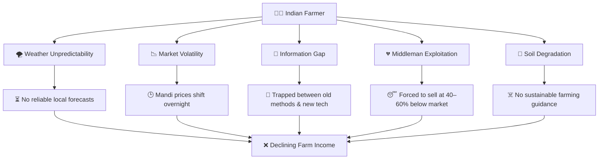
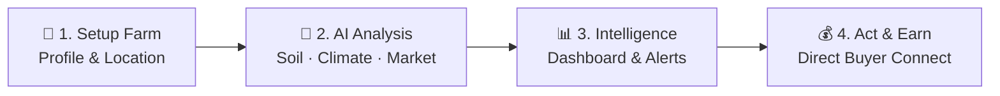
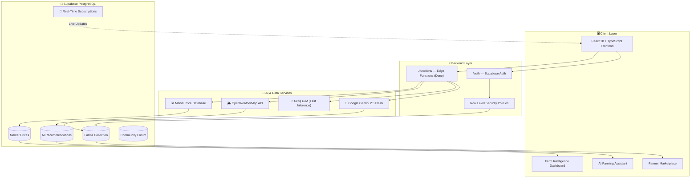
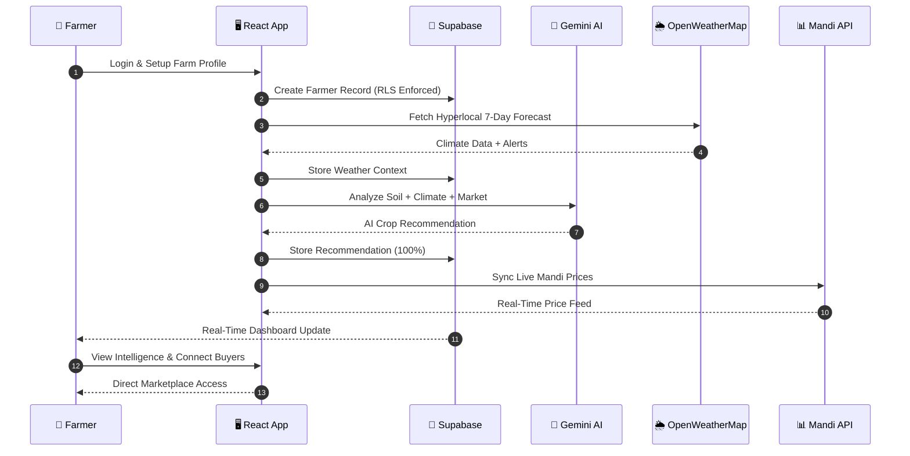
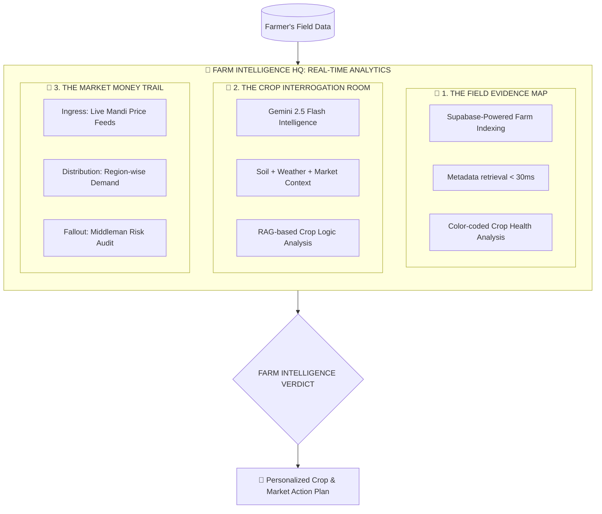
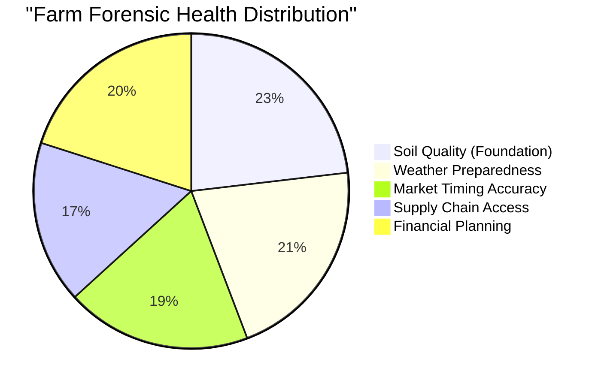
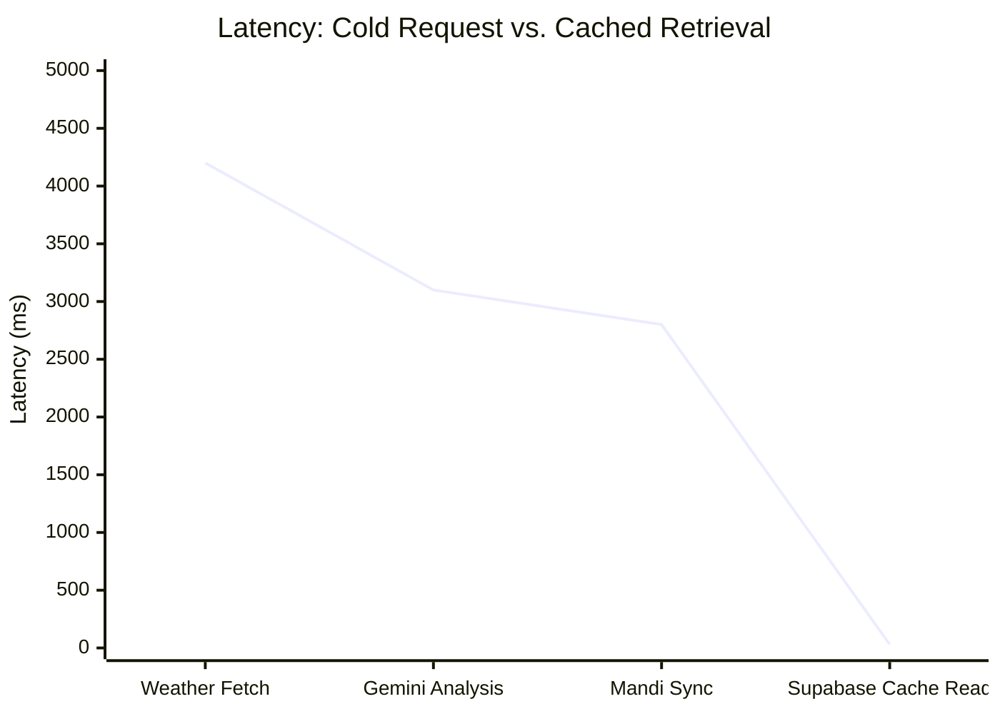
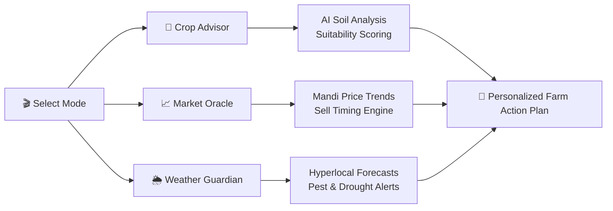

<div align="center">
<a href="https://github.com/your-username/krishigrow">
  
</a>
</div>
<h3 align="center"><i>"Every Farmer Has a Story. Every Field Has Potential. We Make It Talk."</i></h3>

<p align="center">
  <a href="https://agri-companion.vercel.app/"></a>
  <a href="https://reactjs.org/"></a>
  <a href="https://supabase.com/"></a><br/>
  <a href="https://deepmind.google/technologies/gemini/"></a>
  <a href="https://openweathermap.org/"></a>
  <a href="https://vercel.com"></a>
</p>

## 🎥 Demo Video
 
<div align="center">
 
[](https://youtu.be/PhWjIH4LfjI)
 
**▶️ [Watch the Full Demo on YouTube](https://youtu.be/PhWjIH4LfjI)**
 
</div>

# 🎯 The Problem

**Millions of Indian farmers are drowning in a crisis they didn't create.**

<div align="center">



</div>

## 💡 Our Solution :

**KrishiGrowAI** is India's first comprehensive AI-powered farming intelligence companion — transforming raw agricultural data into *actionable decisions* for every farmer, from Vidarbha to the Gangetic Plains.

> *"In this field, every seed tells a story. Some grow into prosperity. Some into disappointment. But with the right intelligence? They all have a fighting chance."*

### 🎬 How It Works



# 🏗️ System Architecture :

### High-Level Overview



### 🔄 Data Flow Sequence



# 🔍 Farm Intelligence Dashboard (CSI Dashboard) :

The **KrishiGrowAI** dashboard is a high-density **Field Intelligence Unit** — it interrogates your farm's data in real-time before recommending a single action.

## 🏛️ The Intelligence Workflow



## 📊 Repository  Analytics


### 🦹🏻 Farm Health "Crime Rate"



### 🏎️ Intelligence Retrieval Velocity



### 🎭 Farm Intelligence Modes



# 🔧 Tech Stack :

<div align="center">

| Category | Technologies |
|:--------:|:------------:|
| **Frontend** |     |
| **Animation / UI** |   |
| **Database** |  |
| **AI Services** |   |
| **3D Graphics** |  |
| **Deployment** |  |

</div>

### 📦 Detailed Stack :

<div align="center">

| Layer | Technology | Purpose |
|:-----:|:----------:|:-------:|
| **Frontend** | React 18, TypeScript, Vite 5 | Fast, type-safe UI with HMR |
| **Styling** | Tailwind CSS 3, Framer Motion | Responsive design, animations |
| **3D Graphics** | Three.js, React Three Fiber | Immersive 3D hero robot scene |
| **Database** | Supabase (PostgreSQL + RLS) | Document storage, real-time sync |
| **Auth** | Supabase Auth | Secure per-farmer data isolation |
| **AI - Analysis** | Google Gemini 2.5 Flash | Crop analysis, recommendations |
| **AI - Chat** | Groq (LLaMA) | Ultra-fast farming Q&A responses |
| **Weather** | OpenWeatherMap API | 7-day hyperlocal forecast + alerts |
| **Routing** | React Router v6 | Client-side navigation |
| **Hosting** | Vercel (Pro) | Serverless deployment, edge CDN |

</div>

# ✨ Key Features :

<div align="center">

| Feature | Description |
|:------:|:-----------:|
| 🤖 **AI Crop Advisor** | Soil + climate + budget → optimal crop mix |
| 🌦️ **Hyperlocal Weather** | 7-day forecasts · Pest alerts · Frost warnings |
| 📈 **Market Price Oracle** | Live mandi prices · AI sell-timing prediction |
| 🛒 **E-Commerce Marketplace** | Buy inputs · Sell produce directly to buyers |
| 🏭 **Smart Storage Finder** | Cold storage booking · Real-time availability |
| 💬 **AI Farming Assistant** | Instant pest ID · Scheme finder · Disease diagnosis |
| 👥 **Community Forum** | Farmer network · Knowledge sharing |
| 💰 **Farm Finance Tools** | ROI calculator · Loan eligibility · Subsidy finder |

</div>

# 🚀 Getting Started :

> Spin up **KrishiGrowAI** locally in minutes.

## 🧰 Requirements :

- **Node.js** ≥ 18 (LTS recommended)
- **Supabase** account (free tier works)
- **API Keys:** Google Gemini · Groq · OpenWeatherMap

## 📦 Project Setup :

```bash
git clone https://github.com/Snehasish-tech/Agri-Companion.git
cd Agri-Companion
npm install
```

### 🔐 Environment Configuration :

```bash
cp .env.example .env
```

### 🐘 Supabase :

```bash
VITE_SUPABASE_URL=your_supabase_url
VITE_SUPABASE_ANON_KEY=your_anon_key
```

### 🤖 AI Services :

```bash
VITE_GEMINI_API_KEY=your_gemini_api_key
VITE_GROQ_API_KEY=your_groq_api_key
```

### 🌦️ Weather :

```bash
VITE_OPENWEATHERMAP_API_KEY=your_openweather_key
```

### ▶️ Run the App :

```bash
npm run dev
```

## 🌐 Access the Application :

```bash
https://agri-companion.vercel.app/
```

> You're ready to empower farmers. 🌾

# 🏆 Hackathon Highlights :

<div align="center">

| Focus Area | What We Delivered |
|:----------:|:-----------------:|
| 🐘 **Supabase Excellence** | PostgreSQL · RLS · Edge Functions · Real-Time Subscriptions |
| 💡 **Product Innovation** | First AI-first smart farming companion for Indian agriculture |
| 🧠 **AI-First Architecture** | Gemini for deep analysis · Groq for ultra-fast chat |
| 🔒 **Security & Performance** | Row Level Security · Edge CDN · Per-farmer data isolation |
| 🚀 **Production Readiness** | Fully deployed, live, and scalable on Vercel |
| 🛠️ **Farmer Impact** | Reduced middleman losses · Better crop timing decisions |

</div>

# 🗺️ Roadmap :

| Status | Feature | Impact |
|:------:|:-------:|:------:|
| ✅ | AI Crop Recommendations | +25% higher yields |
| ✅ | Live Market Prices | +40% better sell rates |
| ✅ | Hyperlocal Weather Alerts | -50% crop losses |
| ✅ | Direct Buyer Connect | -60% middleman losses |
| ✅ | Community Forum | Knowledge sharing at scale |
| ✅ | Farm Finance Tools | Smarter financial planning |
| 🔄 | Mobile App (React Native) | On-field access |
| 🔄 | Multilingual Support (10+ Indian languages) | Wider rural reach |
| 🔄 | PWA Offline Mode | Remote area support |
| 🔄 | Satellite Imagery Integration | Crop health monitoring |
| 🔄 | IoT Sensor Dashboard | Field automation |
| 🔄 | Microfinance Integration | Easy rural loans |

# 👥 Team Members :

<div align="center">

| 👨‍💻 Snehasish | 👨‍💻 Saikat | 👨‍💻 Suvajit | 👨‍💻 Avijit |
|:-------------:|:-------------:|:-------------:|:-------------:|

| [](https://github.com/Snehasish-tech) | [](https://github.com/SaikatPal1911) | [](https://github.com/Suvajit-Code) | [](https://github.com/Avijit-workspace) |

</div>

---

<div align="center">

_**"🌾 Field Analysis Complete."**_ <br/>
**Built with ❤️ for Indian Farmers!**

[](https://supabase.com/)
[](https://vercel.com/)
[](https://deepmind.google/technologies/gemini/)
[](https://openweathermap.org/)

</div>
